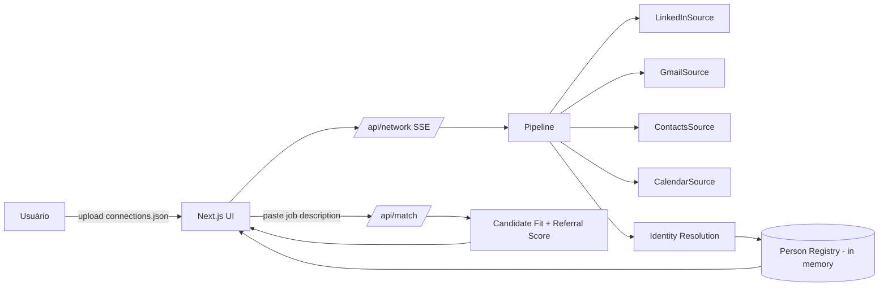

# Referral Copilot

LinkedIn tells us who is in your professional network. Our intelligence layer tells you who
you should refer.

## Problema

Numa plataforma de indicação de vagas, quem indica não é recrutador — tem emprego próprio,
rede grande, pouco tempo. Lembrar manualmente "quem eu conheço pra essa vaga" é difícil,
e frequentemente a indicação simplesmente não acontece.

## Hipótese de produto

Se mapearmos a rede profissional do usuário e a enriquecermos com sinais de relacionamento,
o sistema pode responder proativamente "estas são as pessoas que você deveria considerar
indicar pra esta vaga, e por quê" — antes do usuário lembrar delas sozinho.

## Como rodar

```bash
npm install
npm run dev
```

Abra http://localhost:3000. Clique em "Map my professional network":
- **Com dados reais**: rode `public/linkedin-console-script.js` no console do DevTools em
  `linkedin.com/mynetwork/invite-connect/connections/` (você precisa estar logado — o script
  lê apenas o que já está renderizado na página, não usa o export oficial de 48h nem
  automação de browser). Isso baixa um `connections.json`; suba esse arquivo na tela inicial.
- **Sem upload**: o app roda direto em cima de dados de demonstração realistas.

## Variáveis de ambiente

| Variável | Default | Efeito |
|---|---|---|
| `DEMO_MODE` | `false` | Quando `true`, ignora qualquer `connections.json` enviado e força o LinkedIn também a rodar em fixture — útil pra demonstrar o pipeline completo sem depender de um upload ao vivo. Gmail/Contacts/Calendar já rodam em fixture sempre neste MVP (ver "O que deliberadamente não construímos"). |

## Arquitetura



Toda fonte implementa `NetworkSource.discoverPeople(): AsyncGenerator<Person>`
(`src/lib/sources/base.ts`). O resto do pipeline — identity resolution, enrichment,
relationship scoring, matching, UI — não conhece nada específico de LinkedIn, scraping, ou
fixtures.

## Decisões técnicas

- **Next.js full-stack (TypeScript)** em vez de backend separado: um processo, uma
  linguagem, zero duplicação do modelo `Person`, Route Handlers já fazem SSE.
- **LinkedIn via script de console**, não browser automation: o próprio usuário, já logado,
  roda um script que lê o DOM renderizado — zero bypass de autenticação, zero CAPTCHA
  quebrado, zero sessão roubada. Ver `public/linkedin-console-script.js`.
- **Gmail/Contacts/Calendar são adapters reais, mas rodam em fixture** (`src/lib/sources/fixtures.ts`)
  — OAuth real ficaria fora do orçamento de tempo do desafio; a interface está pronta pra
  ligar credenciais reais depois sem tocar no resto do pipeline.
- **Matching determinístico** (`src/lib/matching/`) — sem LLM no caminho crítico, pra garantir
  que a demo funcione offline e sem custo por rodada.
- **Merge de identidade combina dados de relacionamento campo a campo**: quando a mesma
  pessoa é descoberta em mais de uma fonte (ex.: LinkedIn + Gmail + Calendar),
  `mergePeople` (`src/lib/identity/resolver.ts`) soma contadores de e-mail e reuniões e
  fica com a interação mais recente, em vez de simplesmente sobrescrever — é por isso que
  pessoas mescladas de múltiplas fontes mostram força de relacionamento coerente com o
  histórico real, não apenas o de uma fonte isolada.

## Fluxo da aplicação

1. **Map my professional network** — upload do `connections.json` (ou fallback pra demo),
   pipeline roda as 4 fontes concorrentemente, progresso ao vivo via SSE.
2. **Network Overview** — cobertura de dados (empresa/cargo/localização), busca, todas as
   pessoas.
3. **Referral Copilot** — cola a vaga, recebe candidatos rankeados por `ReferralScore`, cada
   um com evidência real do porquê.

## Modelo de ranking

```
RelationshipScore = 0.30*frequency + 0.30*recency + 0.20*meetings + 0.15*reciprocity + 0.05*contact_signal
CandidateFit       = 0.35*skills + 0.25*role + 0.15*seniority + 0.15*industry + 0.10*location
ReferralScore      = CandidateFit * (0.7 + 0.3*RelationshipScore) * Confidence
```

Uma pessoa levemente menos aderente à vaga, porém muito mais próxima do usuário, pode
superar em `ReferralScore` alguém "mais perfeito" no papel mas praticamente desconhecido.

## Limitações

- Sem Gmail/Calendar reais conectados, `RelationshipScore` cai pro sinal de `contact_signal`
  (ex.: conexões em comum do LinkedIn), sinalizado explicitamente como "sem dados de
  interação" — não fingimos precisão que não temos.
- Extração via console script depende da estrutura DOM atual do LinkedIn; se a LinkedIn
  mudar nomes de classe, o seletor precisa de ajuste manual (comentado no próprio arquivo).
- Sem persistência entre sessões — tudo em memória/sessionStorage, por design (o desafio não
  pede login nem banco de dados).

## What we deliberately did NOT build

- **OAuth real de Gmail/Calendar/Contacts**: adapter pronto, não ligado. Rodar OAuth real em
  ~40h de prazo, sujeito à tela de "app não verificado" do Google travando ao vivo, era mais
  risco do que valor pra uma demo de sexta-feira.
- **Backend separado (FastAPI)**: cortado por simplicidade operacional solo — um único
  processo Next.js cobre orquestração, API e UI sem duplicar o modelo de domínio.
- **Banco de dados**: o próprio desafio pede explicitamente que não seja necessário.
- **Browser automation contra o LinkedIn**: risco de detecção anti-bot e violação de ToS;
  substituído pelo script de console que o próprio usuário roda na sua sessão já logada.
- **Microservices, fila distribuída, Neo4j, Kubernetes**: escopo de produção que não serve a
  um MVP avaliado uma única vez.

## Evolução para produção

A interface `NetworkSource` já isola a aquisição de dados do resto do sistema — trocar a
fixture de Gmail/Calendar por OAuth real, adicionar PostgreSQL/pgvector, sincronização
incremental, multi-tenancy ou uma fila de background jobs não deveria exigir mudanças em
identity resolution, enrichment, scoring, matching ou UI.
