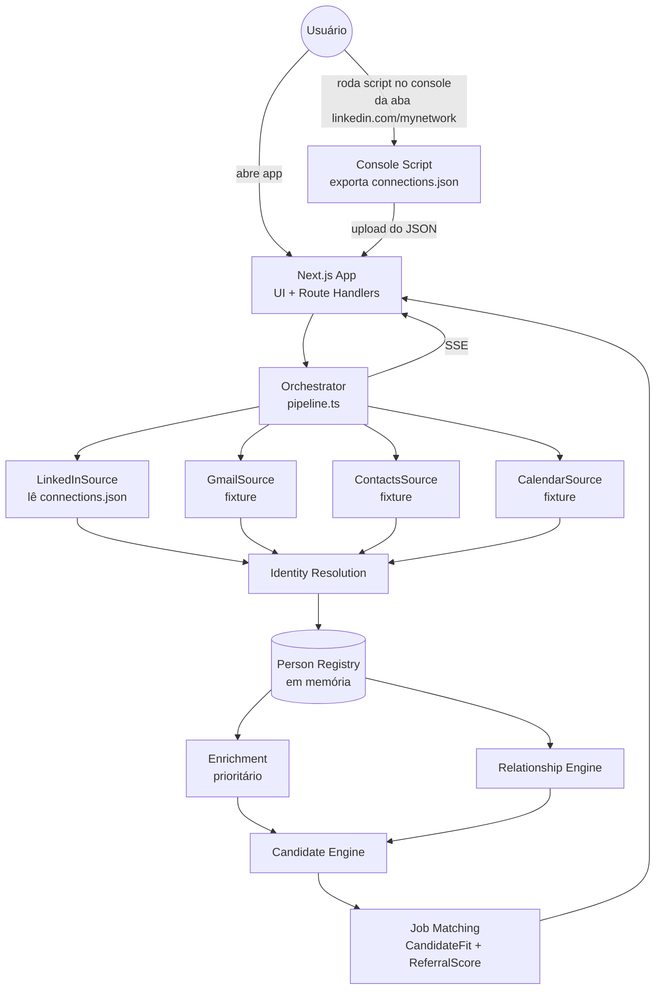

# Referral Copilot — MVP Design

Data: 2026-08-19
Prazo: sexta 2026-08-21, 12h (repo + demo ao vivo)

## 1. Problema

Numa plataforma de indicação de vagas, quem indica não é recrutador: tem emprego próprio,
rede grande, pouco tempo. Ao receber uma vaga, precisa lembrar manualmente "quem eu conheço
que serve pra isso" — tarefa difícil, muitas vezes ignorada, o que reduz indicações e ganhos.

Objetivo: descobrir automaticamente quem está na rede profissional do usuário e quais dessas
pessoas são os melhores candidatos para uma vaga específica, antes mesmo do usuário pensar nelas.

Restrição dura do desafio: extrair a rede em até 5 minutos, sem usar o export de dados do
LinkedIn (demora até 48h), sem exigir login/BD da plataforma, sem acesso a nada da empresa.

## 2. Tese de produto

> LinkedIn nos diz quem está na sua rede profissional.
> A intelligence layer enriquece, rankeia e explica quem indicar.

A extração é infraestrutura. O produto é a resposta: "estas são as pessoas da sua rede que
você deveria considerar indicar pra esta vaga, e por quê."

## 3. Reconciliação com o prazo (decisão central deste design)

Foi apresentada uma arquitetura de North Star ampla: multi-fonte (LinkedIn + Gmail + Contacts +
Calendar) com OAuth real, backend FastAPI separado do frontend Next.js, streaming SSE,
identity resolution multi-sinal, LLM reasoning. Essa é uma arquitetura de produto de várias
semanas de um time.

Restam ~40h corridas até a entrega, solo. Decisão: manter a arquitetura de domínio e a
experiência de produto do North Star inteiras, cortando apenas o que é *puro risco de
integração* sem ganho proporcional dentro do prazo. A cláusula do próprio North Star
autoriza isso: *"se o acesso direto a uma fonte não estiver disponível, preserve a interface
de adapter e implemente uma fonte segura/mock/fixture."*

Cortes, com justificativa:

| Corte | Motivo |
|---|---|
| FastAPI + Next.js separados → **Next.js full-stack em TypeScript** | Uma linguagem, um processo, zero duplicação do modelo `Person`, Route Handlers já fazem SSE. O North Star pré-aprova Node/TS como alternativa. |
| Browser automation (Playwright) no LinkedIn → **script de console rodado pelo próprio usuário** | O North Star proíbe burlar anti-bot/rate-limit; automação de browser contra o LinkedIn é isso. O script de console lê o DOM já renderizado na sessão do próprio usuário, já logado — zero bypass de autenticação, zero CAPTCHA, zero cookie roubado. Roda em segundos. |
| Gmail/Calendar/Contacts com OAuth real → **adapters reais na interface, fixture/demo por padrão, sem OAuth** | Decisão confirmada com o usuário: risco de OAuth travar ao vivo na demo de sexta não compensa. Interface pronta e documentada; ativar OAuth real é próximo passo explícito, não parte do MVP. |
| LLM no caminho crítico de matching → **matching determinístico sempre; LLM só como camada opcional de explicação** | Garante que a demo funcione sem depender de internet/custo de API. |

Tudo mais do North Star (Person model, identity resolution, pipeline em 2 passes, anytime
algorithm, time budget, scoring formulas, explainability, as 3 telas, DEMO_MODE, error
handling por fonte, testes, README) permanece como especificado.

## 4. Arquitetura



Todas as fontes implementam a mesma interface (`NetworkSource.discoverPeople()` — async
generator). O restante do pipeline (identity resolution, enrichment, scoring, matching, UI)
não conhece nada sobre LinkedIn, scraping, ou fixtures — apenas consome `Person`.

## 5. Modelo de dados

`Person`, `RelationshipData`, `ConfidenceData`, `JobProfile` — conforme especificado no North
Star, portados para TypeScript/Zod (equivalente a Pydantic). Sem campos soltos sem semântica.

## 6. Aquisição do LinkedIn (a única fonte real)

1. Usuário abre `linkedin.com/mynetwork/invite-connect/connections/`, já logado.
2. Cola um script no console do DevTools (ou clica num bookmarklet equivalente) fornecido
   pelo app. O script:
   - auto-scrolla a lista até o fim (ou até estabilizar por N ciclos sem gente nova);
   - lê do DOM: nome, headline, url do perfil, foto;
   - baixa um `connections.json`.
3. Usuário sobe esse `connections.json` na tela "Map my professional network" do app.
4. `LinkedInSource.discoverPeople()` lê o arquivo e emite `Person`s progressivamente
   (chunked), preservando a UX de "anytime algorithm" mesmo sendo leitura local (a extração
   real (passo 1-2) já é rápida; o "progressivo" na UI reflete identity resolution +
   enrichment rodando sobre o que já foi lido, não scroll ao vivo).

Isso satisfaz a restrição do desafio (nada de export oficial de 48h) sem violar nenhuma
restrição de segurança (nenhum CAPTCHA quebrado, nenhuma sessão roubada, nenhum rate-limit
evadido — é o navegador do próprio usuário lendo o que ele já vê na tela).

## 7. Pipeline (2 passes, anytime, time-budgeted)

- **Pass 1 — Discovery**: maximiza recall. Emite `Person` mínimo (nome, linkedin_url,
  headline, source) assim que lido do JSON.
- **Identity resolution**: função explícita `resolveIdentity(a, b) -> MergeDecision` com
  sinais ponderados (linkedin_url idêntico ≈ certeza; nome+empresa ≈ confiança média-alta;
  nome sozinho nunca funde). Registra `match_score`, `signals_used`, `merge_reason`.
- **Pass 2 — Enrichment**: parse heurístico do headline (cargo, empresa atual, senioridade,
  indústria a partir de keywords). Prioridade de enrichment = sinal profissional × sinal de
  relacionamento × informação faltante × relevância pra vaga (se houver vaga ativa).
- **Time budget**: `TIME_BUDGET_MS = 290_000`, com fases alvo (bootstrap, discovery,
  identity+enrichment básico, relationship scoring, job-aware enrichment, ranking,
  finalização) — como guia de engenharia, não corte rígido por fase.
- **Saturation**: como a fonte real (LinkedIn via JSON) entrega tudo de uma vez, saturação
  se aplica ao *enrichment*, não à descoberta: taxa de novo enrichment útil por batch decide
  quando parar de aprofundar e realocar tempo pro ranking.

## 8. Relationship / Candidate Fit / Referral Score

Fórmulas exatamente como especificadas no North Star, encapsuladas em módulos configuráveis:

```
RelationshipScore = 0.30·frequency + 0.30·recency + 0.20·meetings + 0.15·reciprocity + 0.05·contact_signal
CandidateFit       = 0.35·skills + 0.25·role + 0.15·seniority + 0.15·industry + 0.10·location
ReferralScore      = CandidateFit × (0.7 + 0.3·RelationshipScore) × Confidence
```

Sem Gmail/Calendar reais (fixture por padrão), `frequency/recency/meetings/reciprocity`
vêm zerados/neutros e `contact_signal` carrega o peso (ex.: conexões em comum, se o LinkedIn
expuser isso na lista). Isso é sinalizado explicitamente na UI (badge "sem dados de
interação") em vez de fingir precisão. Quando as fixtures de Gmail/Calendar estão ativas
(DEMO_MODE), os sinais reais das fixtures alimentam a fórmula normalmente — o pipeline é o
mesmo, só a fonte muda.

## 9. Matching de vaga

`JobProfile` parseado da descrição colada (título, empresa, skills obrigatórias/desejadas,
senioridade, localização, indústria) via heurística determinística (regex/keyword sobre
texto livre — sem LLM no caminho crítico). Camada opcional: se o usuário fornecer uma chave
de API, uma etapa adicional usa LLM só para enriquecer a explicação/interpretação semântica,
nunca para decidir o ranking em si.

## 10. UI — 3 telas

1. **Map my professional network**: CTA único, upload do `connections.json`, status por
   fonte (LinkedIn ✓ / Contacts ◌ / Gmail ◌ / Calendar ◌), contadores ao vivo via SSE
   (people discovered, unique identities, profiles enriched, strong relationships).
2. **Network Overview**: métricas de cobertura (company/role/location coverage), busca e
   filtros, cada pessoa abrível.
3. **Referral Copilot**: campo de colar vaga → lista rankeada por `ReferralScore`, cada card
   com barras de Job Fit / Relationship e lista de evidências ("Why this person?").

## 11. Error handling e DEMO_MODE

Cada fonte tem estado (`pending/running/completed/partial/failed`). Falha de uma fonte não
derruba o pipeline — resultado final é sempre entregue, com limitações visíveis.

`DEMO_MODE=true` ativa fixtures realistas para Gmail/Contacts/Calendar (e, se o usuário não
subir um `connections.json` real, também para LinkedIn) passando pelo mesmo pipeline —
sem UI paralela fake.

## 12. Testes

- Identity resolution: mesmo linkedin_url funde; mesmo nome só não funde; nome+empresa é
  match probabilístico.
- Ranking: fit maior → CandidateFit maior; relacionamento mais forte → ReferralScore maior;
  confiança baixa penaliza.
- Time budget: pipeline encerra antes do deadline duro.
- Falha de fonte: uma fonte falha, as outras completam, resultado final ainda sai.

## 13. O que deliberadamente não construímos

- OAuth real de Gmail/Calendar/Contacts (adapter pronto, não ligado — próximo passo).
- Backend separado (FastAPI) — cortado por simplicidade operacional solo.
- Banco de dados — em memória + JSON, conforme o próprio desafio pede (não precisa de BD).
- Automação de browser (Playwright) contra o LinkedIn — risco de anti-bot/ToS.
- Warm introductions via 2º/3º grau — fora do escopo do MVP, mencionado como evolução futura.
- Multi-tenancy, filas, Kubernetes, Neo4j — não fazem sentido pra um MVP de avaliação única.

## 14. Definition of Done

Igual ao North Star (checklist completo), com a ressalva de que Gmail/Calendar/Contacts
contam como "adapters desacoplados implementados" mesmo rodando em fixture — a interface
existe e é exercitada pelo pipeline real, só não há OAuth ligado a uma conta real.
