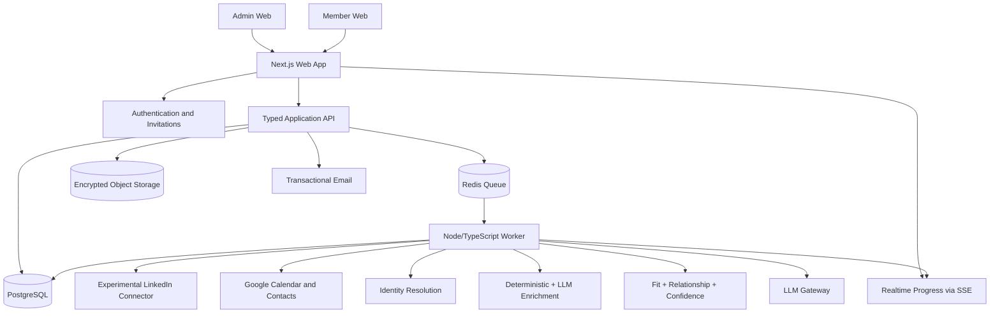

# Referral Copilot — Product Platform Design (“Delivery WOW”)

Data: 2026-08-19  
Status: aprovado para especificação e planejamento  
Base existente: MVP funcional em Next.js, com pipeline de rede, resolução de identidade, scoring e 47 testes automatizados

## 1. Resumo executivo

O Referral Copilot deixa de ser um demonstrador local sem login e passa a ser uma plataforma multiusuário de indicações profissionais. Um administrador cria vagas e convida pessoas da organização. Cada convidado conecta, de forma consentida, fontes que ajudam a compreender sua rede profissional. O sistema identifica contatos potencialmente adequados para as vagas, explica as evidências e pede confirmação ao dono do relacionamento antes de compartilhar qualquer candidato com o administrador.

A promessa do produto é:

> Transformar redes profissionais incompletas e difíceis de lembrar em indicações relevantes, explicáveis e consentidas — em menos de cinco minutos até o primeiro resultado útil.

A estratégia escolhida é uma vertical de produto completa, com fundações de plataforma: autenticação, organizações, convites, persistência, processamento assíncrono, controles de privacidade, IA auditável e uma interface de alto nível. Não construiremos, nesta etapa, toda a complexidade de uma suíte enterprise.

## 2. Contexto e mudança de escopo

O desafio original permite uma solução sem login ou banco e prioriza completude da rede, qualidade do enriquecimento e tempo de entrega. O MVP atual cumpre a jornada básica com dados em memória/sessionStorage, upload de `connections.json`, fixtures para Google e matching determinístico.

O novo escopo altera quatro premissas:

1. A solução deve ser utilizável por organizações reais, não apenas durante a demo.
2. Um administrador cria vagas, convida usuários e acompanha o funil de indicações.
3. Cada usuário possui uma área privada e conecta suas próprias fontes.
4. LLMs enriquecem lacunas e geram insights, sem transformar inferências em fatos silenciosamente.

O motor atual de domínio será preservado onde for sólido. A camada de sessão, as fixtures apresentadas como fontes e a interface minimalista serão substituídas.

## 3. Objetivos e métricas de sucesso

### Objetivos do produto

- Entregar o primeiro shortlist parcial em até cinco minutos após o início da sincronização.
- Aumentar a quantidade de indicações consideradas por vaga sem expor redes privadas ao administrador.
- Melhorar perfis incompletos com inferências explicáveis, níveis de confiança e revisão humana.
- Permitir que uma organização opere o ciclo completo: criar vaga, ativar equipe, descobrir oportunidades, receber indicações e acompanhar status.
- Fazer a demo parecer um produto pronto, com estados reais, continuidade entre sessões e qualidade visual consistente.

### Métricas

- `time_to_first_candidate`: P95 menor que 5 minutos; objetivo interno de 90 segundos.
- `network_activation_rate`: convidados que concluem pelo menos uma conexão de fonte.
- `profile_coverage`: percentual de contatos com cargo, empresa, senioridade e competências suficientes para matching.
- `high_confidence_match_rate`: matches acima do limiar com pelo menos duas evidências.
- `referral_acceptance_rate`: recomendações que o usuário decide indicar.
- `admin_time_to_shortlist`: tempo entre publicação da vaga e primeira indicação consentida.
- `inference_confirmation_rate`: campos inferidos confirmados, corrigidos ou rejeitados pelo usuário.
- `privacy_incidents`: zero exposição de contatos não consentidos ao administrador.

## 4. Princípios de produto

1. **Privado por padrão.** O administrador vê ativação, cobertura e oportunidades agregadas. Um contato só se torna visível após consentimento explícito do usuário.
2. **A IA propõe; o humano confirma.** Inferências recebem rótulo, evidência, confiança, modelo e versão do prompt.
3. **Nunca pedir a senha do LinkedIn.** O login ocorre diretamente no LinkedIn. O produto não recebe, armazena nem retransmite usuário, senha, cookie ou token de sessão do LinkedIn.
4. **Resultado progressivo.** A interface mostra resultados parciais utilizáveis enquanto o processamento continua.
5. **Conectores substituíveis.** A aquisição experimental do LinkedIn fica isolada atrás de uma interface e feature flag.
6. **Explicação antes do score.** A interface responde “por que esta pessoa?” e “quão confiável é?” antes de destacar um número.
7. **Menos esforço, mais decisão.** O usuário não administra um CRM; ele revisa poucas recomendações de alta qualidade.

## 5. Personas e permissões

### Administrador

- Cria e edita vagas.
- Convida e remove membros da organização.
- Reenvia ou revoga convites pendentes.
- Acompanha ativação de fontes, sem acessar credenciais ou dados brutos.
- Vê métricas agregadas de cobertura e processamento.
- Recebe somente indicações aprovadas, com um snapshot dos campos autorizados.
- Move indicações por estados operacionais e registra observações.
- Consulta trilha de auditoria administrativa.

### Usuário indicador

- Aceita convite e cria sua conta.
- Configura idioma e consentimentos.
- Conecta LinkedIn experimental, Google Calendar e Google Contacts.
- Acompanha a própria sincronização e qualidade da rede.
- Revisa inferências relevantes.
- Recebe shortlists privados por vaga.
- Decide indicar, ignorar ou marcar como “não conheço o suficiente”.
- Seleciona quais dados do candidato serão compartilhados.
- Copia uma mensagem de abordagem sugerida por IA; o produto não envia automaticamente.
- Desconecta fontes e solicita exclusão dos próprios dados.

### Limites de RBAC nesta etapa

Existem dois papéis: `ADMIN` e `MEMBER`. Uma pessoa pode pertencer a mais de uma organização no modelo de dados, mas a interface inicial assume uma organização ativa por sessão. Papéis adicionais, SSO corporativo e grupos departamentais ficam fora desta entrega.

## 6. Jornada principal

### Jornada do administrador

1. Cria a organização durante o primeiro acesso.
2. Cria uma vaga a partir de título, descrição, localização e senioridade.
3. A IA converte a descrição em um perfil estruturado; o administrador revisa antes de publicar.
4. Convida usuários por e-mail, individualmente ou por lista.
5. Acompanha um painel com convites, fontes conectadas, cobertura e progresso da análise.
6. A vaga recebe indicadores agregados: redes processadas, oportunidades fortes e usuários ainda pendentes.
7. Indicações confirmadas aparecem no pipeline, com evidências e histórico.

### Jornada do usuário

1. Abre um link de convite com expiração e uso único.
2. Entra por magic link ou código de e-mail; não cria uma senha local.
3. Vê um onboarding de quatro etapas: contexto, privacidade, fontes e primeira análise.
4. Conecta o Google Calendar e o Google Contacts via OAuth com escopos mínimos.
5. Para LinkedIn, abre o LinkedIn em uma aba própria, autentica-se diretamente lá e segue o extrator guiado. A experiência deixa claro que o conector é experimental.
6. A aplicação inicia a ingestão e exibe progresso por fase, resultados parciais e limitações.
7. O usuário recebe recomendações privadas vinculadas às vagas ativas.
8. Ao selecionar “Quero indicar”, revisa o perfil, escolhe os campos compartilhados e confirma.
9. A aplicação cria um snapshot imutável da indicação e oferece uma mensagem de abordagem para copiar.

## 7. Direção de UI/UX

### Linguagem visual

A interface se inspira na clareza técnica do site Gemini CLI sem copiá-lo:

- base quase preta, painéis em grafite e bordas de baixo contraste;
- tipografia sans humanista para conteúdo e mono apenas para estados técnicos, IDs, progresso e evidências;
- branco para hierarquia principal, cinzas frios para conteúdo secundário;
- gradiente azul-violeta reservado para inteligência, progresso e CTAs primários;
- verde para consentimento/conexões verificadas; âmbar para inferências pendentes; vermelho apenas para risco ou falha;
- superfícies amplas, espaçamento generoso e poucas ações por tela;
- animações curtas de entrada, progresso e transição, com suporte a `prefers-reduced-motion`;
- responsividade completa, mas prioridade de composição para desktop na demo administrativa.

### Arquitetura de navegação

Administrador:

- Visão geral
- Vagas
- Equipe
- Indicações
- Auditoria
- Configurações

Usuário:

- Início
- Oportunidades
- Minha rede
- Conexões
- Privacidade

### Momentos “WOW”

1. **Onboarding com confiança:** cada fonte explica exatamente o que lê e o que não lê.
2. **Mapeamento vivo:** contadores, fases e primeiros perfis surgem progressivamente, sem uma tela de espera vazia.
3. **Rede compreendida:** a cobertura melhora diante do usuário e as inferências pendentes aparecem como revisões rápidas.
4. **Insight acionável:** cada recomendação combina fit, relacionamento, confiança e evidências em linguagem natural.
5. **Privacidade visível:** antes de indicar, o usuário vê uma prévia exata do que o administrador receberá.
6. **Painel executivo:** o administrador enxerga movimento real da organização sem invadir redes individuais.

### Estados obrigatórios

Cada tela relevante terá loading, vazio, sucesso, parcial, erro recuperável, erro definitivo, sem permissão e dado desatualizado. Skeletons preservam a geometria. Mensagens de erro explicam impacto, ação recomendada e o que já foi preservado.

## 8. Arquitetura técnica



### Topologia

- **Monorepo TypeScript:** mantém o domínio existente e compartilha schemas entre web, API e worker.
- **Next.js:** interface e endpoints de aplicação de curta duração.
- **Worker separado:** sincronizações, enriquecimento, embeddings e matching não dependem do ciclo de vida de uma requisição web.
- **PostgreSQL:** fonte de verdade transacional, isolamento por organização e histórico.
- **Redis + fila:** jobs idempotentes, retries exponenciais, prioridades e progresso.
- **Object storage criptografado:** payload bruto temporário da ingestão; lifecycle automático remove o arquivo após processamento.
- **SSE:** atualizações de progresso; polling é fallback.
- **E-mail transacional:** convites, magic links e notificações de indicação.

Não serão criados microserviços independentes. Web e worker são processos separados do mesmo código-base e compartilham contratos versionados.

## 9. Modelo de dados

### Núcleo de acesso

- `User`: identidade global, e-mail verificado, idioma e status.
- `Organization`: tenant, nome, slug e políticas de retenção.
- `Membership`: relação usuário-organização, papel e status.
- `Invitation`: e-mail, organização, papel, token com hash, expiração, remetente e status.
- `Session` e `VerificationToken`: suporte à autenticação sem senha.

### Operação

- `Job`: vaga criada por administrador, descrição original, estado e versão.
- `JobProfile`: representação estruturada revisada; skills, senioridade, indústria, localização e pesos.
- `SourceConnection`: owner, tipo, scopes, estado, timestamps e referência criptografada a credenciais OAuth quando aplicável.
- `SyncRun`: fonte, fase, status, progresso, contadores, erro sanitizado e idempotency key.
- `RawImport`: metadados do payload temporário, checksum e data de expiração; nunca senha ou sessão do LinkedIn.

### Rede privada

- `NetworkContact`: pertence ao usuário dono da rede; nome e campos profissionais consolidados.
- `ContactIdentity`: identificadores normalizados e hashes para resolução de identidade.
- `ContactSourceFact`: fato observado, fonte, instante, confiança e proveniência.
- `RelationshipSignal`: contagens e datas derivadas; conteúdo de reunião ou e-mail não é persistido.
- `ProfileInference`: valor proposto, evidências, confiança, modelo, prompt version e estado de revisão.

### Matching e consentimento

- `MatchRun`: vaga, usuário, versão do perfil da vaga e estado.
- `CandidateMatch`: contato privado, scores, explicação, confiança e versão do algoritmo.
- `ConsentGrant`: usuário, contato, vaga, campos autorizados, timestamp e política exibida.
- `Referral`: indicação visível ao administrador, dono do relacionamento, estado e timestamps.
- `ReferralSnapshot`: cópia imutável apenas dos campos consentidos e das evidências aprovadas.
- `AuditEvent`: ator, ação, recurso, tenant, timestamp e metadados sem conteúdo sensível.

### Regra de isolamento

`NetworkContact` nunca é consultado diretamente por uma tela administrativa. Toda visibilidade administrativa passa por agregações sem identificação ou por `ReferralSnapshot`. Queries são sempre limitadas pelo `organizationId` da sessão e testadas contra acesso cruzado.

## 10. Aquisição de dados

### LinkedIn experimental

Sem acesso partner, não existe um caminho oficial para obter toda a rede por API. A primeira versão mantém um conector experimental, explicitamente isolado e substituível.

Fluxo:

1. O usuário inicia uma sincronização e recebe um token de importação de uso único.
2. A aplicação abre a página correta do LinkedIn e apresenta um guia visual.
3. O usuário entra diretamente no LinkedIn; nenhuma credencial passa pelo Referral Copilot.
4. O script fornecido lê somente os cartões de conexões carregados na página, com limite de tempo e de registros.
5. O resultado é baixado localmente e importado no wizard. O upload exige token de uso único, checksum e tamanho máximo.
6. O payload bruto é criptografado, processado pelo worker e apagado pela política de lifecycle.
7. A interface registra o conector como `experimental`, mostra data da última sincronização e permite apagar os dados.

Controles:

- feature flag por organização;
- aceite específico de risco e privacidade;
- nenhum contorno de CAPTCHA, 2FA, rate limit ou bloqueio;
- nenhum cookie, senha ou token de sessão armazenado;
- seletores e parser versionados;
- circuit breaker e encerramento imediato ao detectar challenge/bloqueio;
- documentação clara de que o conector poderá parar de funcionar.

O contrato `NetworkSource` atual permanece, mas recebe contexto de tenant, owner, sync run, checkpoint e cancelamento.

### Google Calendar

- OAuth com escopo mínimo e consentimento separado.
- Coleta somente identificadores normalizados de participantes, datas, recorrência e contagens necessárias.
- Não persiste título, descrição, anexo, link de reunião ou conteúdo.
- Deriva frequência, recência e número de encontros.

### Google Contacts

- OAuth separado do Calendar.
- Coleta nome, e-mails, telefones e organização quando disponíveis.
- Usa os dados para resolução de identidade e sinal de contato.
- O usuário pode conectar apenas uma das duas fontes.

### Sincronização incremental

Cada fonte mantém cursor/checkpoint. Novas sincronizações processam apenas mudanças quando a API permitir. Jobs são idempotentes e uma falha preserva o último snapshot válido.

## 11. Camada de IA

### Casos de uso permitidos

1. Estruturar uma descrição de vaga em `JobProfile`.
2. Normalizar títulos e competências semanticamente equivalentes.
3. Propor cargo, senioridade, indústria e competências ausentes a partir de evidências profissionais disponíveis.
4. Gerar uma explicação curta de recomendação baseada nos sinais calculados.
5. Sugerir uma mensagem de abordagem para o usuário copiar e revisar.
6. Detectar contradições ou baixa informação e solicitar revisão, sem inventar preenchimento.

### Casos de uso proibidos

- Decidir sozinho se alguém deve ser indicado.
- Transformar inferência em fato sem rótulo.
- Enviar mensagens ou compartilhar candidatos automaticamente.
- Usar atributos sensíveis ou proxies de atributos protegidos no ranking.
- Receber conteúdo bruto de Calendar, senhas, tokens ou dados desnecessários.
- Treinar modelos com dados dos usuários sem consentimento específico.

### Pipeline híbrido

1. Regras determinísticas extraem campos evidentes.
2. Embeddings produzem similaridade semântica entre vaga e perfil.
3. O LLM recebe um payload estruturado e minimizado.
4. A resposta usa schema rígido e inclui `value`, `confidence`, `reasoning_summary` e `evidence_refs`.
5. Validações rejeitam campos sem evidência, valores fora do domínio e respostas inconsistentes.
6. O motor determinístico combina fit, relacionamento e confiança.
7. O usuário revisa inferências que afetam recomendações de alta prioridade.

### Score

O score base atual é preservado e versionado:

```text
RelationshipScore = 0.30*frequency + 0.30*recency + 0.20*meetings + 0.15*reciprocity + 0.05*contact_signal
CandidateFit       = 0.35*skills + 0.25*role + 0.15*seniority + 0.15*industry + 0.10*location
ReferralScore      = CandidateFit * (0.7 + 0.3*RelationshipScore) * Confidence
```

O embedding pode melhorar o componente de skills/role, mas não substitui a fórmula nem a proveniência. Toda recomendação armazena `algorithmVersion`, `modelVersion` e evidências.

### Gateway de modelos

Uma interface única abstrai o provedor. Ela implementa timeout, retry limitado, rate limit por organização, orçamento de tokens, redaction, telemetria sem payload sensível e fallback determinístico. Se o modelo falhar, o matching continua com cobertura menor e a UI informa a limitação.

## 12. APIs e eventos principais

### Administração

- `POST /api/organizations`
- `POST /api/invitations`
- `POST /api/invitations/:id/resend`
- `DELETE /api/invitations/:id`
- `POST /api/jobs`
- `PATCH /api/jobs/:id`
- `POST /api/jobs/:id/publish`
- `GET /api/admin/dashboard`
- `GET /api/referrals`
- `PATCH /api/referrals/:id/status`

### Usuário

- `GET /api/me/onboarding`
- `POST /api/source-connections/google/:source/start`
- `POST /api/source-connections/google/callback`
- `POST /api/source-connections/linkedin/import-session`
- `POST /api/source-connections/linkedin/upload`
- `DELETE /api/source-connections/:id`
- `GET /api/sync-runs/:id/events`
- `GET /api/opportunities`
- `POST /api/inferences/:id/review`
- `POST /api/matches/:id/consent`
- `POST /api/matches/:id/dismiss`
- `DELETE /api/me/data`

### Eventos de domínio

- `invitation.accepted`
- `source.connected`
- `sync.started`
- `sync.progressed`
- `sync.completed`
- `sync.partial`
- `profile.inference_created`
- `match.created`
- `match.ready_for_review`
- `referral.consented`
- `referral.status_changed`
- `user.data_deletion_requested`

Eventos são persistidos antes de serem publicados. Jobs consumidores são idempotentes.

## 13. Privacidade, segurança e LGPD

- Minimização de coleta por fonte e finalidade explícita.
- Consentimentos separados para LinkedIn, Calendar, Contacts, IA e compartilhamento de indicação.
- Tokens OAuth criptografados em repouso e nunca retornados ao cliente.
- Segredos fora do banco de aplicação, com rotação e ambientes separados.
- TLS em trânsito; criptografia de banco, backups e object storage.
- Magic links e convites com token armazenado apenas como hash, expiração e uso único.
- Cookies de sessão `HttpOnly`, `Secure`, `SameSite=Lax`; proteção CSRF em mutações sensíveis.
- Rate limiting para login, convite, importação, LLM e endpoints administrativos.
- Validação de MIME, tamanho, schema e conteúdo de uploads; arquivos não são executados.
- Logs sem e-mail completo, token, payload de perfil ou conteúdo bruto.
- Exclusão de fonte remove credencial e agenda purge dos dados derivados exclusivos daquela fonte.
- Exclusão da conta cria job auditável e preserva somente registros legalmente necessários e anonimizados.
- Política inicial de retenção: import bruto por até 24 horas; dados derivados enquanto a conexão estiver ativa; auditoria administrativa por 12 meses. A organização pode escolher retenção menor.
- Exportação dos dados do próprio usuário e canal para correção.
- Revisão jurídica obrigatória antes de liberar o conector LinkedIn experimental fora do piloto.

## 14. Processamento, consistência e erros

### Estados de sincronização

`queued | connecting | discovering | resolving | enriching | matching | completed | partial | failed | cancelled`

Cada fase publica progresso monotônico e checkpoints. Uma fonte falhar não apaga resultados das demais. `partial` é um resultado utilizável com limitações explícitas.

### Idempotência

- Uploads usam checksum e `idempotencyKey`.
- Jobs de fonte são únicos por conexão, cursor e janela.
- Upserts de fatos usam owner, source, external key e observedAt.
- Uma indicação não pode ser criada duas vezes para o mesmo match e versão de consentimento.

### Recuperação

- Retries exponenciais somente para falhas transitórias.
- Erros de autenticação pausam a fonte e pedem reconexão.
- Parser incompatível marca o conector como degradado e preserva o último resultado.
- Falha de LLM usa fallback determinístico.
- Dead-letter queue retém metadados sanitizados para suporte.

## 15. Observabilidade e auditoria

- Métricas por fase: latência, throughput, falha, retry, saturação e custo de LLM.
- Traces correlacionam request, sync run, job e model call sem registrar dados pessoais.
- Alertas para P95 acima de cinco minutos, aumento de falha de parser, filas represadas e erro de OAuth.
- Painel operacional por organização sem expor contatos.
- Auditoria de convite, papel, acesso administrativo, consentimento, indicação, exportação e exclusão.
- Feature flags permitem desligar LinkedIn, LLM ou uma fonte sem indisponibilizar o produto.

## 16. Estratégia de testes

### Unidade

- Regras de domínio, schemas, identity resolution, score, consentimento e transições de estado.
- Parsers com fixtures versionadas e casos incompletos.
- Políticas de autorização por papel e tenant.
- Validação de outputs do LLM e fallback.

### Integração

- Banco real em container para constraints e isolamento.
- Fila e worker com retries, idempotência e cancelamento.
- OAuth com servidor fake e tokens expirados.
- Upload seguro e lifecycle de payload.
- Persistência e replay dos eventos de progresso.

### Contrato

- Contrato comum de `NetworkSource` para LinkedIn, Calendar e Contacts.
- Schemas de API e eventos versionados.
- Golden tests para prompts e respostas estruturadas, sem exigir texto idêntico.

### E2E

- Admin cria organização, vaga e convite.
- Usuário aceita convite, conecta fontes simuladas e conclui onboarding.
- Primeiro resultado aparece progressivamente.
- Usuário revisa inferência, consente e indica.
- Admin vê somente o snapshot consentido.
- Testes negativos confirmam que admin não acessa rede bruta e que tenants não se cruzam.
- Responsividade, teclado, foco, contraste e reduced motion.

### Segurança

- SAST, dependency audit e secret scanning no CI.
- Testes de IDOR, CSRF, upload malicioso, convite reutilizado e elevação de papel.
- Threat model antes do piloto externo.

## 17. Opções consideradas

### A. Redesign sobre o MVP atual

Menor prazo e maior impacto visual imediato, mas continua sem usuários, persistência, privacidade real ou operação administrativa. Rejeitada porque não sustenta a promessa de produto utilizável.

### B. Vertical de produto completa — escolhida

Entrega a jornada real com autenticação, convites, banco, worker, fontes, IA e consentimento. Concentra o investimento no caminho principal e mantém complexidades enterprise fora do primeiro ciclo.

### C. Plataforma enterprise completa

Adicionaria SSO, múltiplos papéis, departamentos, políticas avançadas, data warehouse e integrações corporativas. É uma evolução válida, mas aumenta prazo e risco sem melhorar proporcionalmente a demo.

## 18. Sequenciamento recomendado

### Marco 1 — Fundação segura

- Banco e migrações.
- Auth sem senha, organização, membership e convite.
- Shell visual, design tokens, navegação e RBAC.
- Auditoria básica e isolamento por tenant.

### Marco 2 — Vaga e operação administrativa

- CRUD e publicação de vaga.
- Parser híbrido com revisão do `JobProfile`.
- Dashboard de ativação e estados vazios reais.

### Marco 3 — Onboarding e fontes

- Wizard de privacidade.
- Google Calendar e Contacts OAuth.
- Importação LinkedIn experimental guiada.
- Worker, fila, progresso SSE e persistência.

### Marco 4 — Inteligência de rede

- Identity resolution persistente.
- Enriquecimento determinístico e LLM.
- Inferências revisáveis com confiança e evidência.
- Matching progressivo versionado.

### Marco 5 — Consentimento e indicação

- Shortlist privado.
- Prévia do compartilhamento.
- `ConsentGrant`, `ReferralSnapshot` e pipeline administrativo.
- Mensagem sugerida para copiar.

### Marco 6 — “WOW” e hardening

- Motion, microinterações e polimento responsivo.
- E2E completo e acessibilidade.
- Observabilidade, limites, fallback e feature flags.
- Seed de demo realista que percorre o mesmo pipeline.
- Ensaio cronometrado do fluxo e revisão final de segurança.

## 19. Fora de escopo nesta entrega

- Usuários membros criarem vagas.
- Envio automático de mensagens ou ações no LinkedIn.
- Leitura de conteúdo de Gmail, reuniões ou mensagens.
- SSO/SAML, SCIM e papéis customizados.
- Recrutamento completo, ATS, entrevistas ou ofertas.
- Crawling sem sessão/consentimento, bypass de CAPTCHA ou contorno de bloqueios.
- Treinamento de modelos com dados de usuários.
- Aplicativo móvel nativo.

## 20. Definition of Done

- O administrador cria uma organização, convida usuários e publica uma vaga.
- Um convidado aceita o convite, autentica-se e conclui o onboarding.
- Google Calendar e Contacts funcionam com OAuth real e escopos mínimos.
- O conector LinkedIn experimental nunca recebe senha, cookie ou token de sessão.
- A ingestão persiste dados com isolamento por owner/tenant e apresenta progresso em tempo real.
- O primeiro shortlist parcial aparece em menos de cinco minutos no cenário de referência.
- Inferências mostram evidência, confiança e estado de revisão.
- O administrador não consegue consultar contatos privados por UI ou API.
- Uma indicação só aparece ao administrador após consentimento explícito e contém apenas o snapshot autorizado.
- Falhas de fonte e LLM degradam de forma parcial, sem perder resultados válidos.
- Fluxos críticos possuem testes unitários, integração e E2E.
- Build, lint, testes, migrações e scans de segurança passam no CI.
- A interface PT-BR está completa, o seletor EN funciona e não há textos técnicos expostos sem contexto.
- A demo percorre o mesmo produto e pipeline usados em produção, com dados seed identificados como demonstração.

## 21. Decisões finais assumidas

Como o patrocinador autorizou seguir sem novas interrupções, ficam registradas as decisões adotadas:

- Produto real multiusuário, não apenas fachada de demo.
- Administrador é o único papel que cria vagas.
- Privacidade por padrão; rede individual não é visível ao administrador.
- Calendar e Contacts são opcionais e usam dados mínimos.
- O usuário confirma a indicação; nenhuma abordagem é enviada automaticamente.
- Interface em português por padrão, com internacionalização PT/EN.
- Aquisição LinkedIn é experimental, sem captura de credenciais, isolada e preparada para substituição futura por integração oficial.
