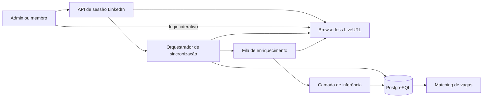

# Referral Copilot — Conexão LinkedIn sem instalação

**Status:** aprovado para implementação

**Prazo do piloto:** noite de 20 de agosto de 2026

**Hipótese escolhida:** sessão remota temporária com enriquecimento progressivo

## 1. Objetivo

Substituir integralmente o fluxo que exige extensão, console, pasta local ou upload técnico por uma experiência de usuário final:

1. a pessoa clica em **Continuar com LinkedIn**;
2. aceita um aviso curto de privacidade;
3. autentica-se diretamente em um navegador remoto temporário;
4. acompanha o mapeamento e o enriquecimento da rede;
5. recebe recomendações enquanto o restante da rede continua sendo processado.

O mesmo fluxo atende administradores e membros convidados. Nenhuma aprovação, parceria ou API oficial do LinkedIn faz parte do caminho crítico desta entrega.

## 2. Princípios do produto

- Zero instruções de desenvolvedor na interface.
- Uma ação principal por etapa.
- Resultado útil em minutos, sem esperar a rede inteira.
- Coleta apenas de informações profissionais visíveis à conta autenticada.
- Inferências sempre acompanhadas de evidência e confiança.
- Sessão remota efêmera, isolada e encerrável pela pessoa.
- Nenhuma tentativa de contornar CAPTCHA, checkpoint, bloqueio ou limite.
- Rede privada de membros nunca é listada para administradores.

## 3. Escopo da entrega desta noite

### Incluído

- Integração server-side com Browserless por meio de um adaptador substituível.
- Criação de uma `LiveURL` interativa e temporária.
- Popup ou nova aba para autenticação normal no LinkedIn.
- Detecção de login sem leitura ou registro de credenciais.
- Inventário inicial das conexões visíveis.
- Enriquecimento progressivo dos perfis, priorizado por vagas abertas.
- Progresso, cancelamento, timeout e retomada segura da interface.
- Persistência estruturada dos dados profissionais coletados.
- Fila assíncrona para processamento e inferência.
- Feature flag e limite inicial de duas sessões simultâneas.
- Fluxo compartilhado por administradores e membros.

### Não incluído

- API partner ou permissão oficial de conexões do LinkedIn.
- Extensão Chrome/Edge, console, pasta, bookmarklet ou upload exposto ao usuário.
- CAPTCHA solving, stealth agressivo, rotação de identidade ou bypass de proteção.
- Sessão permanente ou reutilização de cookies em sincronizações futuras.
- Garantia de enriquecimento de 100% da rede em um tempo fixo.
- Ações sociais, mensagens ou alterações dentro do LinkedIn.

## 4. Experiência do usuário

### 4.1 Entrada

A seção LinkedIn contém apenas:

- título **Conecte sua rede**;
- explicação em uma frase;
- botão **Continuar com LinkedIn**;
- estado atual da última sincronização, quando existir.

Não aparecem instruções sobre extensão, extrator, arquivo ou console.

### 4.2 Consentimento

Antes de criar a sessão, uma confirmação informa:

- o navegador roda temporariamente em infraestrutura contratada pela plataforma;
- teclado e tela trafegam criptografados, mas não são armazenados;
- cookies existem somente dentro da sessão efêmera;
- dados profissionais visíveis serão coletados e usados para recomendações;
- a pessoa pode encerrar a sessão a qualquer momento.

### 4.3 Autenticação e progresso

O clique abre imediatamente uma nova aba do Referral Copilot em estado de preparação, evitando bloqueio de popup. O backend cria a sessão Browserless e redireciona essa aba somente para a URL interativa de curta duração. O token da conta Browserless nunca chega ao cliente.

A experiência abre em uma nova aba. O app exibe os estados:

- `Preparando sessão`;
- `Aguardando login`;
- `Login confirmado`;
- `Mapeando conexões`;
- `Enriquecendo perfis — N de M`;
- `Resultados iniciais disponíveis`;
- `Concluído`, `Pausado`, `Cancelado` ou `Precisa de atenção`.

O inventário completo é salvo primeiro. Assim que houver perfis relevantes enriquecidos, as recomendações aparecem sem aguardar o restante.

### 4.4 Interrupções

- **Encerrar agora:** fecha o navegador remoto e cancela tarefas ainda não iniciadas.
- **Checkpoint/CAPTCHA:** pausa e pede intervenção na mesma sessão; não tenta resolver automaticamente.
- **Timeout de login:** encerra a sessão após 10 minutos sem autenticação.
- **Enriquecimento:** pode continuar por até 45 minutos após o login, enquanto a sessão existir.
- **Falha externa:** preserva os resultados já confirmados e permite nova tentativa em outra sessão.

## 5. Arquitetura

### 5.1 Componentes

#### `LinkedInBrowserProvider`

Interface que isola o fornecedor:

- `createSession(owner, timeout)`;
- `createInteractiveUrl(session)`;
- `getPage(session)`;
- `closeInteractiveUrl(session)`;
- `destroySession(session)`.

A primeira implementação usa Browserless. O restante do produto não conhece URLs, tokens ou comandos específicos do fornecedor.

#### `LinkedInSyncOrchestrator`

Controla a máquina de estados, detecta login, cria o inventário, agenda perfis, emite progresso e garante limpeza em bloco `finally`.

#### `LinkedInProfileCollector`

Converte o DOM visível em estruturas validadas. Seletores ficam versionados e testados em fixtures separadas da lógica de negócio.

#### Worker de enriquecimento

Consome perfis priorizados, visita páginas com ritmo conservador, persiste evidências e para ao detectar checkpoint, limite ou cancelamento.

#### Camada de inferência

Recebe somente dados profissionais estruturados. Nunca recebe senha, cookie, HTML de login ou conteúdo de campos sensíveis.

## 6. Dados coletados

### 6.1 Inventário

- nome;
- headline;
- URL profissional;
- foto, quando disponível;
- localização;
- grau de conexão.

### 6.2 Perfil enriquecido

- cargo atual;
- histórico de cargos, empresas, períodos e progressões;
- instituições de ensino, cursos, graus e períodos;
- principais habilidades visíveis;
- certificações;
- idiomas;
- resumo profissional;
- projetos e atividades profissionais relevantes;
- experiências internacionais;
- conexões em comum, quando visíveis.

Cada campo mantém `source_url`, horário da observação e confiança de extração. Campos ausentes permanecem `null`; o coletor não inventa valores.

### 6.3 Inferências

- senioridade provável;
- especialidades;
- tier de formação;
- tier das empresas;
- exposição internacional;
- potencial como candidato;
- potencial como indicador;
- evidências textuais;
- confiança da conclusão;
- modelo e versão das regras utilizados.

Inferências não substituem fatos e nunca são apresentadas como decisão automática de contratação.

## 7. Priorização e ritmo

1. Coletar todo o inventário possível da página de conexões.
2. Calcular uma prioridade inicial usando vagas abertas, headline, empresa, cargo e capital de rede.
3. Enriquecer primeiro os perfis com maior relação com as vagas.
4. Continuar a fila até concluir, expirar a sessão ou encontrar uma proteção do LinkedIn.
5. Atualizar recomendações incrementalmente.

O piloto começa com:

- duas sessões simultâneas;
- uma página de perfil por vez em cada sessão;
- atrasos variáveis e conservadores entre navegações;
- timeout de login de 10 minutos;
- duração total máxima de 45 minutos;
- pausa imediata diante de checkpoint, `429`, CAPTCHA ou desafio adicional.

Esses limites são configuração, não constantes espalhadas pelo código.

## 8. Modelo de dados

### `linkedin_sync_sessions`

- `id`, `organization_id`;
- `owner_type`, `owner_id`;
- `status`;
- `provider_session_reference` criptografada com chave server-side e apagada ao finalizar;
- `inventory_count`, `enriched_count`, `failed_count`;
- `consented_at`, `started_at`, `authenticated_at`, `finished_at`;
- `expires_at`, `last_heartbeat_at`;
- `failure_code`, `failure_message_safe`.

Nenhum cookie ou senha é persistido nessa tabela.

### Dados profissionais

Os contatos existentes continuam sendo a identidade principal. Para cumprir o prazo do piloto, experiências, educação, habilidades, certificações e evidências são armazenadas em JSONB versionado, mantendo a origem e a data da coleta. A interface do repositório permite normalização futura sem alterar consumidores.

Dados de membros permanecem privados. Para administradores, a rede administrativa continua segregada por `administrator_id`.

## 9. APIs

- `POST /api/linkedin/sessions` — registra consentimento e cria sessão.
- `GET /api/linkedin/sessions/[id]` — retorna somente estado e métricas seguras.
- `POST /api/linkedin/sessions/[id]/cancel` — encerra e limpa.
- `GET /api/linkedin/sessions/[id]/events` — progresso por SSE.
- Callback interno autenticado do worker para transições, se necessário.

Todas as rotas derivam o proprietário da sessão autenticada. IDs enviados pelo cliente nunca autorizam acesso por si mesmos.

## 10. Segurança e privacidade

- `BROWSERLESS_API_TOKEN` somente no servidor.
- LiveURL curta, não reutilizável e vinculada à sessão do Referral Copilot.
- CSP e `referrer-policy` impedem vazamento da LiveURL.
- Segredos, teclado, screenshots e cookies não entram em logs.
- Sem gravação de vídeo ou replay de sessão.
- Navegador destruído em sucesso, erro, cancelamento e timeout.
- Watchdog encerra sessões órfãs.
- Limite por organização e por usuário.
- Auditoria contém apenas eventos operacionais e contagens.
- Feature flag permite desligar o conector sem indisponibilizar Google, inferência ou o restante do produto.
- Revisão jurídica continua recomendada antes de escalar além do piloto.

## 11. Erros e recuperação

| Situação | Comportamento |
|---|---|
| Browserless indisponível | Não cria sessão; oferece tentar novamente e usar Google |
| Nova aba bloqueada | Exibe botão explícito para tentar novamente ou continuar na mesma aba |
| Login não concluído | Timeout e destruição automática |
| CAPTCHA/checkpoint | Pausa e pede ação do usuário |
| Seletor alterado | Marca coletor como degradado, preserva inventário e interrompe perfil afetado |
| Rate limit | Pausa a fila; não aumenta agressividade |
| Usuário cancela | Fecha navegador, marca `cancelled` e impede novos jobs |
| Worker cai | Watchdog encontra sessão órfã e executa limpeza |
| Perfil incompleto | Persiste fatos disponíveis e deixa campos ausentes como `null` |

## 12. Testes e critérios de aceite

### Automatizados

- máquina de estados da sessão;
- isolamento entre organizações, administradores e membros;
- token Browserless nunca serializado para o cliente;
- criação, cancelamento, timeout e limpeza idempotente;
- parsers com fixtures para inventário e perfil;
- priorização por vagas;
- persistência incremental;
- interrupção em checkpoint e limite;
- ausência de cookies, senha e conteúdo de login nos logs;
- UI mobile-first em cada estado;
- regressão completa do matching e da privacidade de membros.

### Validação manual do piloto

1. Administrador inicia uma sessão real.
2. Faz login diretamente no LinkedIn remoto.
3. Inventário retorna contatos reais.
4. Ao menos um perfil é enriquecido com cargo, experiência, educação e habilidades quando visíveis.
5. Progresso aparece no app.
6. Encerrar agora destrói a sessão.
7. Nova sessão não reutiliza o login anterior.
8. Membro executa o mesmo fluxo sem expor sua rede ao administrador.

### Definição de pronto

- Nenhuma tela do produto pede extensão, console, pasta ou arquivo.
- Fluxo real funciona com `BROWSERLESS_API_TOKEN` configurado.
- Resultados iniciais aparecem antes do enriquecimento total.
- Sessões são destruídas e não deixam credenciais persistidas.
- Produção pode desligar o conector por feature flag.
- Falhas mostram uma ação recuperável, nunca um beco sem saída.

## 13. Configuração

- `LINKEDIN_REMOTE_SYNC_ENABLED`;
- `BROWSERLESS_ENDPOINT`;
- `BROWSERLESS_API_TOKEN`;
- `LINKEDIN_MAX_CONCURRENT_SESSIONS=2`;
- `LINKEDIN_LOGIN_TIMEOUT_MS=600000`;
- `LINKEDIN_SESSION_TIMEOUT_MS=2700000`;
- `LINKEDIN_PROFILE_DELAY_MIN_MS`;
- `LINKEDIN_PROFILE_DELAY_MAX_MS`.

## 14. Riscos conhecidos

- O DOM do LinkedIn muda e exige manutenção de seletores.
- O LinkedIn pode solicitar verificação ou limitar navegação automatizada.
- A rede completa pode não ser enriquecida dentro de uma única sessão.
- A disponibilidade do piloto depende do fornecedor remoto e de uma chave válida.
- A abordagem deve permanecer experimental, consentida e desligável.

Nenhum desses riscos autoriza bypass. O produto informa cobertura parcial e preserva resultados confirmados.
